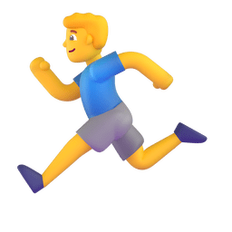
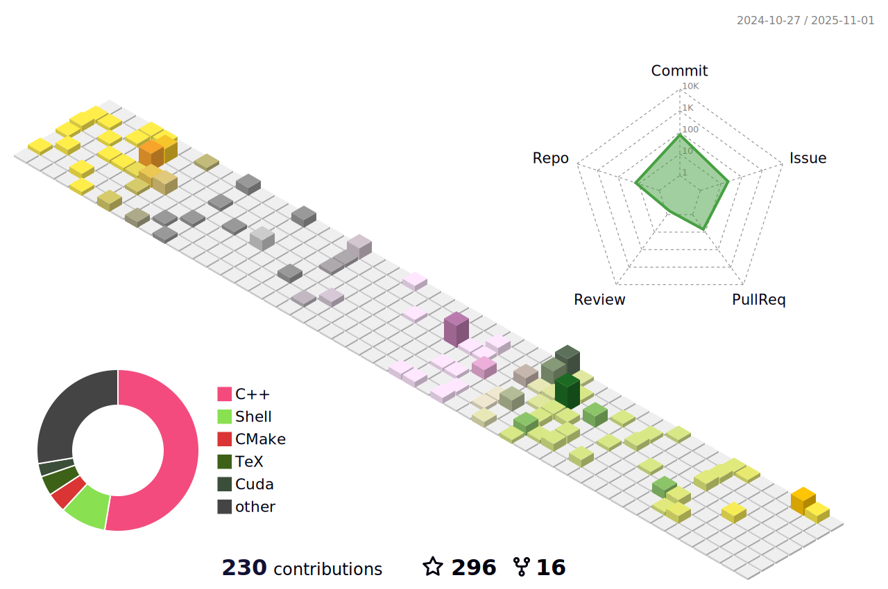

<link rel="stylesheet" href="assets/css/github-markdown.css">

  <!-- dynamic typing effect 动态打字效果 -->
  

    
  

  <!-- knock code pictures 敲代码的图片 -->
  <picture>
    <source media="(prefers-color-scheme: dark)" srcset="assets/images/coding.gif" />
    <source media="(prefers-color-scheme: light)" srcset="assets/images/developer.svg" height="225px" />
    
  </picture>

  <!-- for beauty 留个空行好看点 -->
  
&nbsp;

  <!-- profile logo 个人资料徽标 -->
  

    <!-- visitor -->
    &emsp;
    <!-- discussions -->
    &emsp;
    <!-- wakatime -->    
    

  

  <!-- Snake Code Contribution Map 贪吃蛇代码贡献图 -->
  <picture>
    <source media="(prefers-color-scheme: dark)" srcset="profile-snake-contrib/github-contribution-grid-snake-dark.svg" />
    <source media="(prefers-color-scheme: light)" srcset="profile-snake-contrib/github-contribution-grid-snake.svg" />
    
  </picture>

<h1>🙋 Hello </h1> 

<table align="center">
  
<tr><td>

<h3>🤺 About Me</h3> 

&emsp;&emsp;Hello everyone, I'm Dapeng Feng, a PhD student in computer science and technology.
 

&emsp;&emsp;I'm passionate about exploring computer vision, robotics, and computer graphics.

&emsp;&emsp;I take inspiration from Steve Jobs, who believed in changing the world through innovation.

&emsp;&emsp;I enjoy sharing ideas, learning from others, and blending technology with creativity to make a difference.

&emsp;&emsp;If you're interested in tech, innovation, or just making things better, I'd love to connect and chat.

&emsp;&emsp;Feel free to open a <a href="https://github.com/DapengFeng/DapengFeng/discussions">Discussion</a>!

&emsp;&emsp;<strong>We're making the world a better place. Through constructing elegant hierarchies for maximum code reuse and extensibility.</strong>

</td></tr>

<tr><td>

<h3>🏢 Education Experience</h3>

<ul>

<li>
<a href="https://www.sysu.edu.cn">Sun Yat-sen University</a> &emsp; 📌 2021-09-01 —— Now

<ul>
<li>Ongoing Ph.D.</li>
<li>Computer Science and Technology</li>
</ul>
</li>

<li>
<a href="https://www.sysu.edu.cn">Sun Yat-sen University</a> &emsp; 📌 2018-08-29 —— 2021-06-20

<ul>
<li>Master&#39;s degree</li>
<li>Pattern Recognition and Intelligent Systems</li>
</ul>
</li>

<li>
<a href="https://www.gdufs.edu.cn/">Guangdong University of Foreign Studies</a> &emsp; 📌 2014-09-14 —— 2018-06-21

<ul>
<li>Bachelor&#39;s degree</li>
<li>Computer Science and Technology</li>
</ul>
</li>
</ul>

</td></tr>

<tr><td>

<h3>📊 WakaTime</h3> 

<picture>
  <source
    srcset="https://github-readme-stats.vercel.app/api/wakatime?username=@DapengFeng&layout=compact&text_color=f0f6fc&bg_color=00000000&hide_border=true&hide_title=true&langs_count=20"
    media="(prefers-color-scheme: dark)"
  />
  <source
    srcset="https://github-readme-stats.vercel.app/api/wakatime?username=@DapengFeng&layout=compact&text_color=1f2328&bg_color=00000000&hide_border=true&hide_title=true&langs_count=20"
    media="(prefers-color-scheme: light)"
  />
  
</picture>

</td></tr>

</table>

<!-- ########################################## 分割 ########################################## -->

<!-- run 图片 -->

<!-- Joke 笑话 -->

  <picture>
    <source media="(prefers-color-scheme: dark)" srcset="https://readme-jokes.vercel.app/api?hideBorder&bgColor=%23121212" />
    <source media="(prefers-color-scheme: light)" srcset="https://readme-jokes.vercel.app/api?hideBorder&bgColor=%ffffff" />
    
  </picture>

<!-- github-readme-streak-stats 连续提交代码天数记录 -->

<picture>
  <source media="(prefers-color-scheme: dark)" srcset="https://github-readme-streak-stats.herokuapp.com/?user=DapengFeng&theme=dark&hide_border=true" />
  <source media="(prefers-color-scheme: light)" srcset="https://github-readme-streak-stats.herokuapp.com/?user=DapengFeng&theme=light&hide_border=true" />
  
</picture>

<!-- metrics 基础资料 -->

&emsp;

&emsp;

<!-- GitHub Activity Graph GitHub 活动图 -->

<table>
  <tr>
    <td>
      <picture>
        <source media="(prefers-color-scheme: dark)" srcset="https://github-readme-activity-graph.vercel.app/graph?username=DapengFeng&theme=xcode&bg_color=FF000000&hide_border=true" />
        <source media="(prefers-color-scheme: light)" srcset="https://github-readme-activity-graph.vercel.app/graph?username=DapengFeng&theme=xcode&bg_color=FF000000&color=000000&hide_border=true" />
        
      </picture>
    </td>
  </tr>
</table>

<!-- ########################################## 分割 ########################################## -->

<!-- just img 图片 -->

<!-- Quotes 名人名言 -->

  <picture>
    <source media="(prefers-color-schem: dark)" srcset="https://quotes-github-readme.vercel.app/api?type=horizontal&theme=dark" />
    <source media="(prefers-color-schem: light)" srcset="https://quotes-github-readme.vercel.app/api?type=horizontal&theme=light" />
    
  </picture>

  
<!-- GitHub 奖杯🏆 -->

<!-- GitHub 数据统计 -->

 

<!-- ########################################## 分割 ########################################## -->

<!-- just img 图片 -->

<!--  skill badge 技能徽章 -->

  
   
   
   
   
   
   
  
   

<!-- programming tool icon 编程工具图标 -->
 

<!-- svg -->

<!-- profile-3d-contrib 3D 贡献图-->
<picture>
  <source media="(prefers-color-scheme: dark)" srcset="profile-3d-contrib/profile-night-rainbow.svg" />
  <source media="(prefers-color-scheme: light)" srcset="profile-3d-contrib/profile-season-animate.svg" />
  
</picture>

<!-- ########################################## 分割 ########################################## -->

<!-- GitHub metrics 信息指标 -->

<!-- just img 图片 -->

<!-- first form 第一个表格 -->
<table>
  <tr>
    <td></td>
  </tr>
</table>

<!-- second form 第二个表格 -->
<table>
  <tr>
    <td></td>
    <td></td>
  </tr>
<!--    <tr>
    <td></td>
    <td></td>
  </tr> -->
<!--   <tr>
    <td></td>
    <td></td>
  </tr> -->
<!--   <tr>
    <td></td>
    <td></td>
  </tr> -->
</table>

<!--  -->

<!-- just img 图片 -->

