<p align="right">
  <a href="README.md">English</a> · <strong>简体中文</strong>
</p>

<picture>
  <source media="(max-width: 600px) and (prefers-color-scheme: dark)" srcset="assets/profile/hero-dark-mobile.svg">
  <source media="(max-width: 600px) and (prefers-color-scheme: light)" srcset="assets/profile/hero-light-mobile.svg">
  <source media="(prefers-color-scheme: dark)" srcset="assets/profile/hero-dark.svg">
  <source media="(prefers-color-scheme: light)" srcset="assets/profile/hero-light.svg">
  
</picture>

我是冯大鹏。我构建帮助机器人**感知与重建世界**的系统，也做让开发更顺手的小工具。

<p>
  <a href="https://dapengfeng.github.io/"><samp>[个人网站]</samp></a> &nbsp;
  <a href="#-ls-projects"><samp>[项目目录]</samp></a> &nbsp;
  <a href="https://github.com/DapengFeng/DapengFeng/discussions"><samp>[打个招呼]</samp></a>
</p>

### `$ git log --author=DapengFeng -5`

<!--RECENT_COMMITS:START-->
- `2026-10-10` `DapengFeng/genesis` · [`22e0601`](https://github.com/DapengFeng/genesis/commit/22e0601b19736ae043bf11b556ccfc06c22a4e3f) — [chore: refine contribution templates and fix hook autoupdate](https://github.com/DapengFeng/genesis/commit/22e0601b19736ae043bf11b556ccfc06c22a4e3f)
- `2026-10-09` `DapengFeng/dapengfeng.github.io` · [`c5b2b95`](https://github.com/DapengFeng/dapengfeng.github.io/commit/c5b2b9589306e9e36a4c468d69676b0836625114) — [fix: make catalog browser checks resilient to new posts](https://github.com/DapengFeng/dapengfeng.github.io/commit/c5b2b9589306e9e36a4c468d69676b0836625114)
- `2026-10-08` `DapengFeng/dapengfeng.github.io` · [`32f0df0`](https://github.com/DapengFeng/dapengfeng.github.io/commit/32f0df07e80ab328c302a51701b8fa9351925175) — [feat: add IceCube neutrino Nobel physics article](https://github.com/DapengFeng/dapengfeng.github.io/commit/32f0df07e80ab328c302a51701b8fa9351925175)
- `2026-10-08` `DapengFeng/dapengfeng.github.io` · [`a2980b4`](https://github.com/DapengFeng/dapengfeng.github.io/commit/a2980b46b75a7e09cd8012e7f56fe3d4b85f4e64) — [feat: add PyTorch operator schema and codegen article](https://github.com/DapengFeng/dapengfeng.github.io/commit/a2980b46b75a7e09cd8012e7f56fe3d4b85f4e64)
- `2026-10-07` `DapengFeng/dapengfeng.github.io` · [`f8566a2`](https://github.com/DapengFeng/dapengfeng.github.io/commit/f8566a206f365986f11a2360f1db2ef0d78c53ec) — [feat: refine site reading experience and consolidate authoring docs](https://github.com/DapengFeng/dapengfeng.github.io/commit/f8566a206f365986f11a2360f1db2ef0d78c53ec)

<sub>Dates: UTC+08:00 · Up to 20 recently pushed public repositories scanned · Default branches only.</sub>
<!--RECENT_COMMITS:END-->

<sub>计划每小时自动刷新。</sub>

### `$ ls projects/`

<details>
<summary><samp><strong>cartgs/</strong></samp> — 3D 高斯溅射 SLAM · IEEE RA-L</summary>

<br>

**CaRtGS** — 基于 3D 高斯溅射的实时照片级 SLAM。像素输入，重建世界输出。

[<samp>[代码]</samp>](https://github.com/DapengFeng/cartgs) &nbsp; [<samp>[论文]</samp>](https://arxiv.org/abs/2410.00486) &nbsp; [<samp>[演示]</samp>](https://dapengfeng.github.io/cartgs/)

</details>

<details>
<summary><samp><strong>S3E/</strong></samp> — 协同 SLAM 数据集 · IEEE RA-L</summary>

<br>

**S3E** — 多机器人数据集，集齐激光雷达、双目相机、IMU 和 UWB。建图，也可以组队开黑。

[<samp>[仓库]</samp>](https://github.com/DapengFeng/S3E) &nbsp; [<samp>[论文]</samp>](https://arxiv.org/abs/2210.13723) &nbsp; [<samp>[数据集]</samp>](https://dapengfeng.github.io/S3E/)

</details>

<details>
<summary><samp><strong>RustCxx/</strong></samp> — Rust 的想法，C++20 的语法</summary>

<br>

**RustCxx** — 仅头文件的 C++20 库，带来 Rust 风格的枚举、`Result` 和 `Option`。C++ 说想多点选择，于是我给它写了 `Option`。

[<samp>[代码]</samp>](https://github.com/DapengFeng/RustCxx)

</details>

### `$ cat notes/index`

- [<samp>pytorch-internals/</samp>](https://dapengfeng.github.io/series/pytorch-internals/) — 跟着一次运算走进 PyTorch 源码。
- [<samp>travel-notes/</samp>](https://dapengfeng.github.io/blog/?category=travel) — 终端之外的旅行、照片与日常观察。

<details>
<summary><samp>$ cat profile.json</samp></summary>

<br>

```json
{
  "name": "Dapeng Feng",
  "interests": [
    "Computer vision",
    "Robotics",
    "Computer graphics"
  ],
  "languages": ["Python", "C++"],
  "tools": [
    "PyTorch", "OpenCV", "ROS",
    "Linux", "Git", "CMake", "LaTeX"
  ]
}
```

</details>

<details>
<summary><samp>$ cat education.log</samp></summary>

<br>

- **博士 · 计算机科学与技术**<br>中山大学 · 2021 年 9 月—2026 年 6 月 21 日
- **硕士 · 模式识别与智能系统**<br>中山大学 · 2018—2021 年
- **学士 · 计算机科学与技术**<br>广东外语外贸大学 · 2014—2018 年

</details>

<details>
<summary><samp>$ cat .rubber-duck.log</samp></summary>

<br>

```text
小黄鸭  T_wc 把什么映射到哪里？
机器人  相机 -> 世界。
小黄鸭  输入点在哪个坐标系里？
机器人  世界。

[取了一次逆之后]

机器人  哦。
```

</details>

<details>
<summary><samp>$ ./contribution-snake</samp></summary>

<br>

```text
[warn] 有人在偷吃 commit。
```

<picture>
  <source media="(prefers-color-scheme: dark)" srcset="profile-snake-contrib/github-contribution-grid-snake-dark.svg">
  <source media="(prefers-color-scheme: light)" srcset="profile-snake-contrib/github-contribution-grid-snake.svg">
  
</picture>

</details>

---

<samp>dapeng@github:~$</samp> **[打个招呼](https://github.com/DapengFeng/DapengFeng/discussions)**

一个论文问题、一个奇怪的 bug、一个还没想清楚的点子，都欢迎来聊。尤其欢迎一起探索 3D 视觉、SLAM、机器人，以及让开发更顺手的工具。
